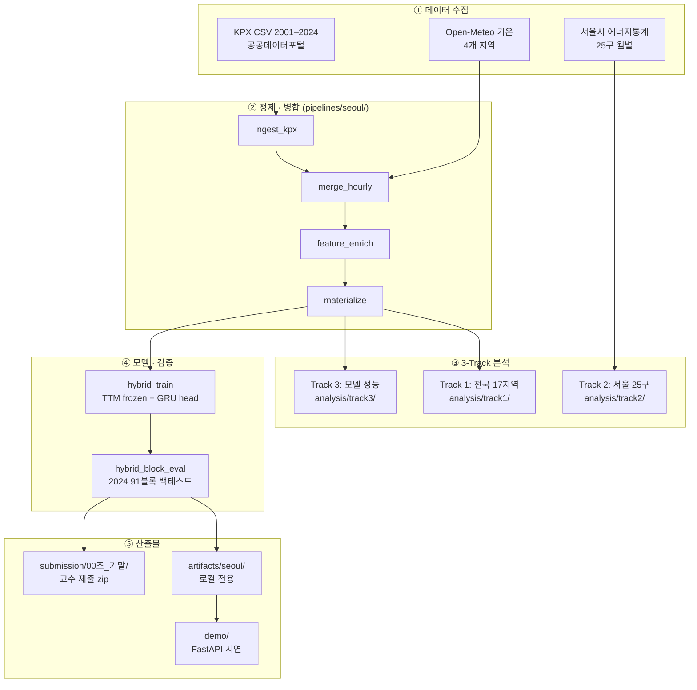
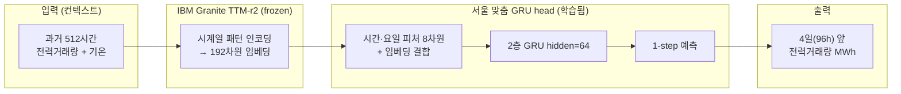
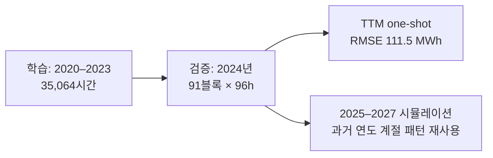
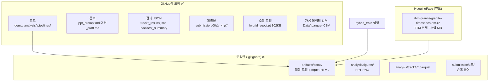

# 조3조 기말 프로젝트 — KPX 전력거래량 분석 및 AI 예측

> **과목:** 파이썬데이터분석 (서지훈) · **조3조**  
> **레포:** https://github.com/Kyle-Riss/granite-tsfm  
> **베이스:** [IBM granite-tsfm](https://github.com/ibm-granite/granite-tsfm) (Granite TTM 시계열 파운데이션 모델)

| 멤버 | 학번 |
|------|------|
| 하유빈 | 202004124 |
| 곽소민 | 202204173 |
| 황준연 | 202384068 |
| 박선준 | 202304226 |
| 공지수 | 202301099 |

---

## 이 프로젝트는 무엇인가

**한국전력거래소(KPX) 지역별·시간대별 전력거래량**과 **기온 데이터**를 결합해,

1. 전국·서울의 **전력 거래 패턴**을 분석하고 (Track 1·2)
2. IBM Granite **시계열 AI(TTM)** + 서울 맞춤 예측기(GRU head)로 **4일 앞 전력거래량**을 예측하며 (Track 3)
3. **FastAPI 대시보드**로 결과를 시연합니다.

> KPX 데이터는 **전력 소비량이 아니라 도매시장 거래량**입니다.  
> 발전소가 있는 지역(충남)과 없는 지역(서울)의 숫자 차이는 데이터 오류가 아니라 **구조적 차이**입니다.

---

## 왜 이 방식을 쓰는가

| 문제 | 우리 접근 |
|------|-----------|
| 지역마다 전력 구조가 다름 (발전 vs 소비) | Track 1: 17개 지역 KPX 거래 구조 비교 |
| 서울 안에서도 구별 격차 큼 | Track 2: 25개 구 실소비 + 인구 분석 |
| 기존 통계 모델은 한파·명절에 약함 | Track 3: TTM 96h one-shot — 이상 기상에서 GRU 대비 **77% 낮은 오차** |
| 처음부터 모델을 만들기엔 데이터·시간 부족 | **frozen TTM**(IBM 사전학습) + **GRU head**(서울 데이터만 추가 학습) |

**핵심 검증:** 2020–2023 학습 → **한 번도 안 본 2024년** 91블록 백테스트 → 평균 오차 **약 111 MWh (17%)**

---

## 전체 파이프라인 (데이터 → 분석 → 모델)



---

## 모델 파이프라인 (예측 한 번의 흐름)



**학습 / 검증 split**



| 미래 연도 | 컨텍스트로 쓰는 실측 |
|-----------|---------------------|
| 2025 | 2024년 같은 계절 |
| 2026 | 2023년 같은 계절 |
| 2027 | 2022년 같은 계절 |

---

## Git 레포 구조 — 무엇이 올라가고 무엇은 로컬인가



### `.gitignore` 요약

| 경로 | 이유 |
|------|------|
| `/artifacts/` | TTM·GRU·parquet·HTML — 용량 큼, 파이프라인으로 재생성 |
| `/analysis/figures/` | PPT 그림 — 스크립트로 재생성 |
| `/analysis/track1/*.parquet` | 분석 중간 산출물 |
| `/submission/3조/` | `00조_기말/`과 중복 |
| `.venv/`, `__pycache__/` | 환경·캐시 |

### clone 후 데모를 돌리려면

```bash
git clone https://github.com/Kyle-Riss/granite-tsfm.git
cd granite-tsfm
uv pip install -e ".[notebooks]"   # 또는 pip

# ① TTM 본체 (최초 1회, HuggingFace 캐시)
python -c "from transformers import AutoModel; AutoModel.from_pretrained('ibm-granite/granite-timeseries-ttm-r2')"

# ② 로컬 artifacts 필요 (팀원 PC에 있거나 직접 학습)
python -m pipelines.seoul.hybrid_train          # → artifacts/seoul/hybrid_seoul.pt
python -m pipelines.seoul.materialize             # → regional_hourly_34k.parquet 등
```

> 제출 zip(`submission/00조_기말/`)에는 **GRU head(302KB)** 만 포함. TTM 본체는 HuggingFace에서 받습니다.

---

## 폴더 가이드

```
granite-tsfm/
├── README.ko.md              ← 이 문서
├── demo/                     ← FastAPI 시연 대시보드
├── analysis/                 ← Track 1~3 분석 스크립트·JSON
├── pipelines/seoul/          ← 데이터 병합·학습·백테스트 (재현 핵심)
├── submission/00조_기말/     ← 교수님 제출 zip (노트북·샘플·소형 모델)
├── ppt_prompt.md             ← PPT 18슬라이드 설계
├── 대본_draft.md             ← 발표 대본
├── report_revised.md         ← 보고서 수정본
├── Data/                     ← 병합·기온 parquet (Git 포함)
└── artifacts/seoul/          ← 로컬 전용 (모델·검증·PPT 그림)
```

---

## 사용 방법

### 1) 교수님 제출 (zip)

```bash
cd submission/00조_기말
zip -r ../조3조_기말.zip .
```

포함: 노트북, 샘플 CSV 3종, `hybrid_seoul.pt`, `backtest_summary_2020_2024.json`  
GitHub: https://github.com/Kyle-Riss/granite-tsfm

### 2) 발표 데모 (FastAPI + 외부 공유)

```bash
# 터미널 1 — 서버
TRANSFORMERS_OFFLINE=1 .venv/bin/python -m uvicorn demo.app:app --host 127.0.0.1 --port 8001

# 터미널 2 — Cloudflare Quick Tunnel (학교 와이파이: http2 필수)
cloudflared tunnel --url http://127.0.0.1:8001 --protocol http2
```

→ `https://....trycloudflare.com` URL 공유 (재실행 시 URL 변경)  
상세: [`demo/README.md`](demo/README.md)

### 3) 전체 파이프라인 재현

상세 명령어: [`pipelines/seoul/README.md`](pipelines/seoul/README.md)

```bash
python -m pipelines.seoul.ingest_kpx      # KPX 수집
python -m pipelines.seoul.merge_hourly  # 기온 병합
python -m pipelines.seoul.materialize   # parquet 생성
python -m pipelines.seoul.hybrid_train  # 모델 학습
python -m pipelines.seoul.hybrid_block_eval --target-year 2024  # 백테스트
```

### 4) PPT 그림 재생성 (로컬)

```bash
python analysis/track1/load_kpx.py && python analysis/track1/analyze_and_viz.py
python scripts/generate_ppt_figures.py
# → artifacts/seoul/ppt_figures/*.png
```

---

## 주요 검증 수치 (발표·보고서 인용용)

| 항목 | 수치 | 출처 |
|------|------|------|
| TTM 2024 연간 RMSE | **111.5 MWh** (~17%) | `model_compare_block_annual_verified.json` |
| GRU roll 2024 | 158.9 MWh | 동일 |
| Seasonal 24h | 107.2 MWh | 동일 |
| 1월 한파 TTM vs GRU | 135 vs **578** MWh (77%↓) | `live_4block_jan` |
| H1 U자형 | ✅ 기준온 ~18°C | `sensitivity_51.json` |
| H2 서울 최고 민감 | ❌ 기각 — 부산 23배 | Track 1 slope |
| H3 평일 집중 | ✅ | Track 1 시간대 패턴 |

---

## 추후 활용 가능성

| 방향 | 설명 |
|------|------|
| **지역별 특화 모델** | 서울 학습 모델을 부산·대전·강원에 그대로 쓰면 오차율 4배 — 지역별 GRU head 추가 학습으로 확장 |
| **수요반응(DR) 연계** | 4일 앞 예측 + 폭염·한파 시나리오 → 피크 시간 DR 사전 발동 의사결정 지원 |
| **계통 운영 보조** | 명절·연휴 수요 급감 예측 → 발전 출력 하향·정비 일정 최적화 |
| **탄소·에너지 정책** | 구별 실소비(Track 2) + 거래량(Track 1) 이중 뷰 → 지역 맞춤 절전·피크 조절 정책 |
| **실시간 서비스화** | FastAPI 데모 → Named Tunnel(`demo.tsfmdash.com`) 또는 클라우드 VM 상시 배포 |
| **데이터 갱신** | 2025년 실측 공개 시 학습 범위 확장 → 미래 시뮬레이션을 실측 검증으로 대체 |

---

## 가설 검증 요약

| 가설 | 결과 |
|------|------|
| H1 기온–전력 U자형 비선형 | ✅ 확인 |
| H2 서울이 가장 기온 민감 | ❌ 기각 (부산이 23배 더 민감) |
| H3 평일 낮 집중·주말 완만 | ✅ 확인 |

---

## IBM 원본 레포

이 프로젝트는 IBM `granite-tsfm`을 fork하여 서울 전력 데이터에 맞게 확장했습니다.  
IBM TSFM 원본 설치·노트북 안내는 아래를 참고하세요.

→ [README.md (English — IBM upstream)](README.md)
